# Домашнее задание к занятию "13.3 работа с kubectl"

## Задание 1: проверить работоспособность каждого компонента

### Вопрос

Для проверки работы можно использовать 2 способа: port-forward и exec. Используя оба способа, проверьте каждый компонент:
* сделайте запросы к бекенду;
* сделайте запросы к фронту;
* подключитесь к базе данных.

### Ответ

Имеем следующую конфигурацию кластера

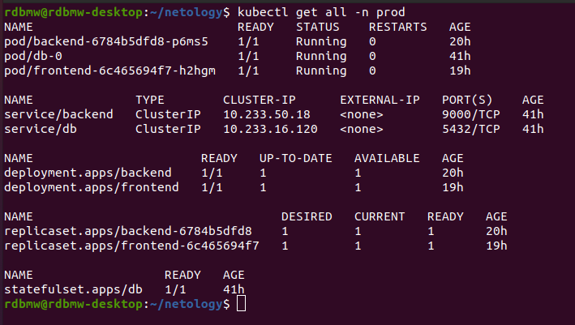

Запрос с фронтенда к бекенду через exec

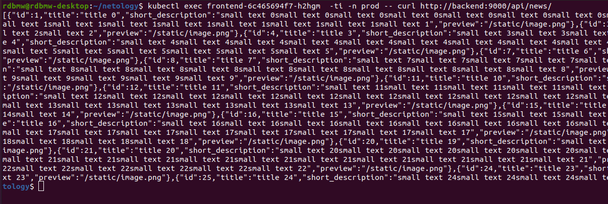

сделаем port-forward на бекенд

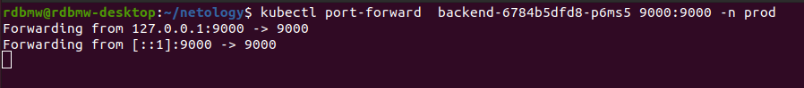

и проверим ответ через ```curl localhost:9000```

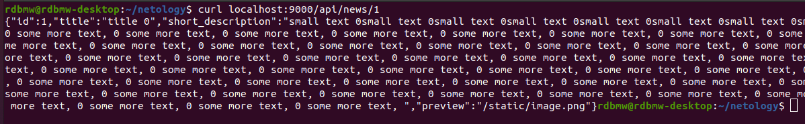

Сделаем аналогичные проверки фронтенда 

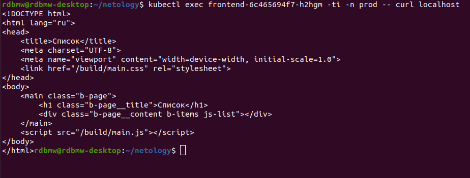

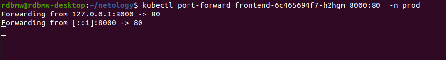

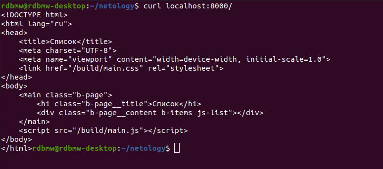

Подключимся к базе данных

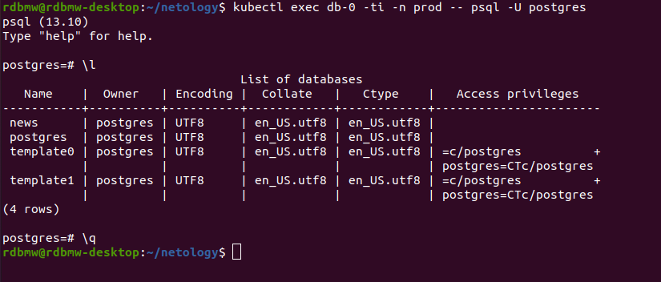


## Задание 2: ручное масштабирование

### Вопрос

При работе с приложением иногда может потребоваться вручную добавить пару копий. Используя команду kubectl scale, попробуйте увеличить количество бекенда и фронта до 3. Проверьте, на каких нодах оказались копии после каждого действия (kubectl describe, kubectl get pods -o wide). После уменьшите количество копий до 1.

### Ответ

Имеем следующую конфигурацию кластера

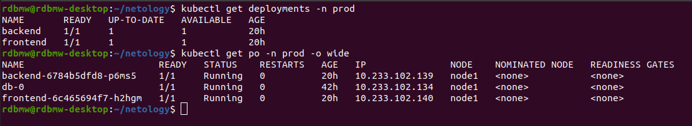

Увеличим количество подов фронтенда и бекенда до 3х

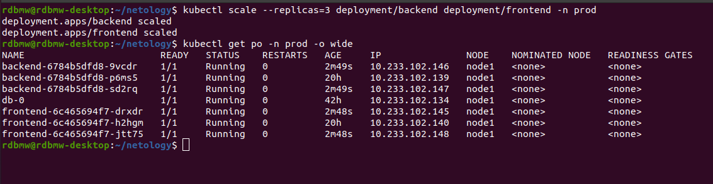

Увеличим количество подов до 1го для бекенда и фронтенда

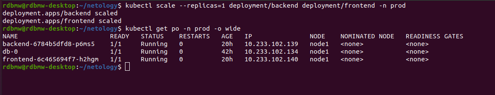